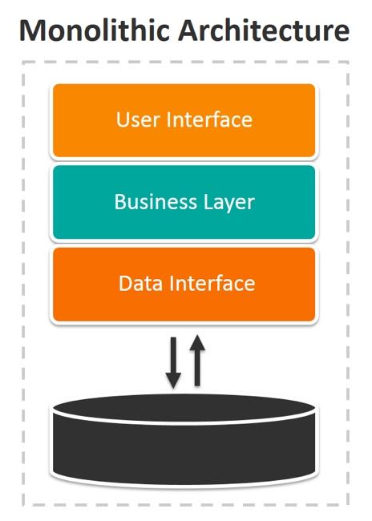
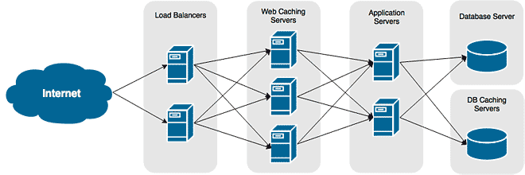
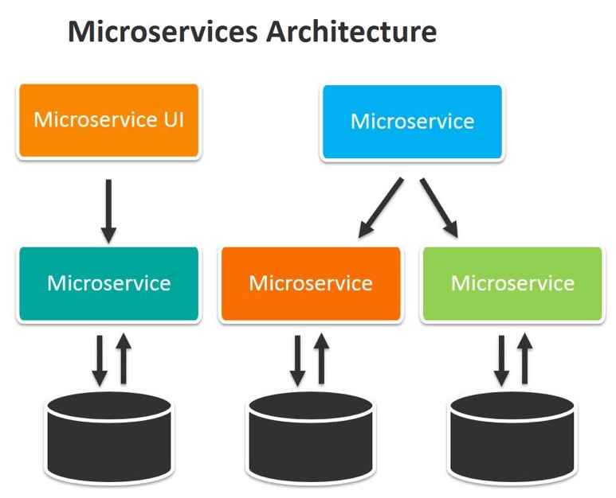

= Monolithic vs Microservices Architectures

== Application As Monolithic Architecture

Imagine a real-world scenario where we model a monolithic architecture for an application within a pharmaceutical company. In this simplified emulation, we'll conceptualize the application as running on a single server. For the sake of clarity, we will avoid getting into the intricacies of the actual code and instead concentrate on understanding the application's functionalities and the 'big picture' it paints.

=== Creating our application

Every application needs a designated location to reside, so let’s begin by creating a dedicated directory on our server for the examples we'll be using in this scenario:

[source,shell]
----
mkdir -p app/{monolithic,microservice}
----

The command above will generate a directory structure as the following:

[source,shell]
----
app
├── microservice
└── monolithic 
----

We have created a directory named `app` to store all versions of our application. Within this directory, we’ve created a `monolithic` folder to emulate the installation of the application on a single server as a single service. Additionally, we've set up a `microservice` folder, which will be used in the second part of this exercise.

==== Installing pre-requisites

Given that our application is developed in Python using the FLASK framework, our initial requirement is to have pip installed to facilitate the installation of flask."

[source,shell]
----
sudo dnf install -y pip
pip install Flask
----

=== Executing our Monolithic Application

For the current phase, our attention will be dedicated to the monolithic aspect, with plans to revisit the microservice version later.

Within this monolithic framework, we consolidate all functionalities, including order processing, placement, inventory management, delivery handling, user notifications, and other services encapsulated within a singular Flask application. This straightforward integration involves managing all operations within a single script.

The code is a simple python script that can be found in this repository called pharmacy.py that simulates the monolithic application. Place it inside the `monolithic` folder in your system and run the application with the following command:

[source,shell]
----
$ python3 pharmacy.py
 * Serving Flask app 'pharmacy'
 * Debug mode: on
 * Running on http://127.0.0.1:5000
Press CTRL+C to quit
 * Restarting with stat
 * Debugger is active!
 * Debugger PIN: 120-148-555
----

As our application runs on port 5000, the debugger currently occupies our terminal. Consequently, we need to open a new terminal to simplify testing the application through direct API calls using CURL commands.

=== Testing the Application

Once the Flask app is operational, it's usually accessible at `http://127.0.0.1:5000/` or `http://localhost:5000/` by default.

Tools such as Postman or cURL can be employed to send requests to various endpoints defined in the Flask application (e.g., `/place_order`, `/view_inventory`, `/view_orders`, `/view_customer/<customer_id>`).

Keep in mind that this example involves running a basic Flask server locally solely for testing purposes. In a production environment, the application would be deployed on a dedicated server and typically integrated with a database for robust data storage.

Let's initiate the testing phase with a straightforward direct call to our application:

[source,shell]
----
$ curl http://127.0.0.1:5000
<!doctype html>
<html lang=en>
<title>404 Not Found</title>
<h1>Not Found</h1>

The requested URL was not found on the server. If you entered the URL manually please check your spelling and try again.

----

While we can confirm that the application is responsive, it's apparent that the specific instruction we intended to pass is currently unavailable. This is because we didn't provide any instructions in the previous attempt.

Let's try again, this time focusing on verifying the inventory:

[source,shell]
----
$ curl http://127.0.0.1:5000/view_inventory
{
  "inventory": {
    "medicine_A": {
      "price": 10,
      "stock": 100
    },
    "medicine_B": {
      "price": 15,
      "stock": 50
    }
  }
}
----

It's evident that making direct calls to an API is a straightforward process. Now, let's leverage the view_customer function to retrieve and display information about our customers:

[source,shell]
----
$ curl http://127.0.0.1:5000/view_customer/customer_id_1
{
  "customer_details": {
    "address": "123 Main St",
    "name": "John Doe"
  }
}

$ curl http://127.0.0.1:5000/view_customer/customer_id_2
{
  "customer_details": {
    "address": "456 Elm St",
    "name": "Alice Smith"
  }
}
----

Let's attempt to display our active orders, although we are aware that they are currently empty:

[source,shell]
----
$ curl http://127.0.0.1:5000/view_orders
{
  "orders": []
}
----

Proceeding to introduce an order into the system. If we carefully examine our application code, we'll observe that order placement utilizes the POST method.

[source,shell]
----
$ curl -X POST \
    -H "Content-Type: application/json" \
    -d '{"customer_id": "customer_id_1", "medicine": "medicine_A", "quantity": 5}' \
    http://localhost:5000/place_order

{
  "message": "Order placed successfully",
  "order_details": {
    "customer_id": "customer_id_1",
    "medicine": "medicine_A",
    "quantity": 5,
    "status": "Pending",
    "total_price": 50
  }
}
----

Consequently, we can now retrieve and display our active orders once again:

[source,shell]
----
$ curl http://127.0.0.1:5000/view_orders
{
  "orders": [
    {
      "customer_id": "customer_id_1",
      "medicine": "medicine_A",
      "quantity": 5,
      "status": "Pending",
      "total_price": 50
    }
  ]
}
----

In a more realistic scenario, our application will feature a distributed architecture with high availability and resilience capabilities, utilizing multiple databases and servers to host different components of the solution.

=== Terminating the monolithic application

Before continuing, ensure the termination of the monolithic application running on port 5000 by using the `CTRL+C` key combination in the first opened terminal where the Flask application is attached.

== Application as Microservices Architecture

To transition from the monolithic architecture of the pharmacy application to a microservices-oriented approach, we will segment functionalities into distinct Flask applications, each representing a separate service. The services we'll create include Inventory Management, Order Processing, Customer Management, and Billing.

IMPORTANT: All the files mentioned below must be placed within the microservices folder.

. Inventory Management Service: This service is responsible for handling operations related to inventory. File: inventory_service.py
. Order Processing Service: This service oversees the processes of order placement and tracking. File: order_service.py
. Customer Management Service: This service is dedicated to handling customer information and details. File: customer_service.py
. Billing Service: Responsible for managing billing and payment processes. File: billing_service.py

=== Running Our Microservices

Each of these services should be stored in separate files and can be executed independently, as each application operates on its designated port.

[source,shell]
----
$ ls microservice/
billing_service.py  customer_service.py  inventory_service.py  order_service.py
----

Notice, that different from our previous monolithic version, here every service is running independently and therefore each one needs to be running on it's independent port.

[source,shell]
----
$ grep app.run *.py | sort -n
inventory_service.py:    app.run(port=5001)
order_service.py:    app.run(port=5002)
customer_service.py:    app.run(port=5003)
billing_service.py:    app.run(port=5004)
----

To run each service independently, open four separate terminals, one for each service, and execute them as follows:

On terminal one:

[source,shell]
----
python3 inventory_service.py
----

On terminal two:

[source,shell]
----
python3 order_service.py
----

On terminal three:

[source,shell]
----
python3 customer_service.py
----

On terminal four:

[source,shell]
----
python3 billing_service.py
----

These services can communicate with each other through HTTP requests (API calls) or message brokers like Kafka or RabbitMQ, depending on your specific requirements.

=== Testing Our Microservices Application

Once all the Flask apps are operational, they can typically be accessed at http://127.0.0.1:500?/ or http://localhost:500?/ by default. (Note the ? in the port, which will change based on the type of service.)

Let's now attempt to verify the inventory running on port 5001:

[source,shell]
----
$ curl http://127.0.0.1:5001/view_inventory
{"inventory":{"medicine_A":{"price":10,"stock":100},"medicine_B":{"price":15,"stock":50}}}
----

If an attempt is made to use the view_inventory service on a different port, it will result in failure, as this service is exclusively running on port 5001.

[source,shell]
----
$ curl http://127.0.0.1:5002/view_inventory
<!doctype html>
<html lang=en>
<title>404 Not Found</title>
<h1>Not Found</h1>

The requested URL was not found on the server. If you entered the URL manually please check your spelling and try again.

----

Moving forward, let's review our customer information accessible on port 5003:

[source,shell]
----
$ curl http://127.0.0.1:5003/view_customer/customer_id_1
{"customer_details":{"address":"123 Main St","name":"John Doe"}}

$ curl http://127.0.0.1:5003/view_customer/customer_id_2
{"customer_details":{"address":"456 Elm St","name":"Alice Smith"}}
----

Given that we are aware there are currently no active orders, let's proceed to add one using the service running on port 5002. 

[source,shell]
----
$ curl -X POST \
    -H "Content-Type: application/json" \
    -d '{"customer_id": "customer_id_1", "medicine": "medicine_A", "quantity": 5}' \
    http://localhost:5002/place_order

{"message":"Order placed successfully"}
----

Subsequently, we can print our active orders by utilizing the view_orders service running on the same port 5002.

[source,shell]
----
$ curl http://127.0.0.1:5002/view_orders
{"orders":[]}
----

Notice something went wrong with the view_orders service – it appears to be failing to store the order. Let's address this issue!

Importantly, there is no need to halt the service at this point. Open the order_service.py script and replace the existing code at the fix directory in the repository:

Next, use the `CTRL + c` key combination to halt the service currently running on the `second terminal`, and immediately restart the service in the same terminal.

Now, proceed to add an order. 

[source,shell]
----
$ curl -X POST \
    -H "Content-Type: application/json" \
    -d '{"customer_id": "customer_id_1", "medicine": "medicine_A", "quantity": 5}' \
    http://localhost:5002/place_order

{"message":"Order placed successfully","order_details":{"customer_id":"customer_id_1","medicine":"medicine_A","quantity":5,"status":"Pending"}}
----

Subsequently, print our active orders using the view_orders service running on port 5002:

[source,shell]
----
$ curl http://127.0.0.1:5002/view_orders
{"orders":[{"customer_id":"customer_id_1","medicine":"medicine_A","quantity":5,"status":"Pending"}]}
----

Great! We have successfully transitioned to the microservices version of our application."

image::../images/micro2.jpg[]
